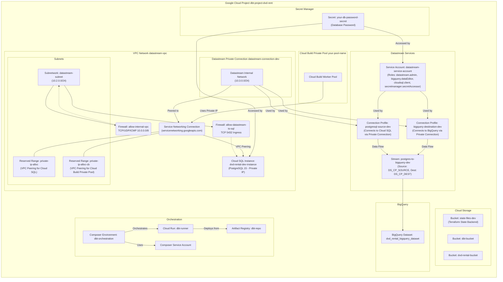

## Settings
1. Install Terraform on your machine
2. Install Google Cloud CLI
After installing the Google Cloud CLI, initialize it by running the following command:
```bash
gcloud init
```
3. Authentification on gcloud on local shell

``` bash
gcloud auth application-default login
```

## Pre configuration
You must set your postgresql password in `Secret Manager` to use in cloud SQL PostgreSQL db

## Run Terraform


Initiate Terraform
```bash
terraform init
```

Planning Terraform workspace
```bash
terraform plan
```

Apply creating resources in gcp
```bash
terraform apply
```

Remove select resource
```bash
terraform state rm --dry-run google_sql_database.dvd_rental_db
```

Create one resource
```bash
terraform apply --target=google_sql_database.dvd_rental_db
```


Destroy all resources
```bash
terraform destroy plan
```

```bash
terraform apply
```

Or 
```bash
terraform destroy -auto-approve
```

Delete on resource
 
```bash
terraform destroy -target=google_compute_network.datastream_vpc
```


Show detail of a specific resource
```bash
terraform state show resouce_type.resource_name
```


## Add publication in bd PostgreSQL after deploiement

```sql
CREATE PUBLICATION dvd_rental_publication FOR ALL TABLES;
SELECT pg_create_logical_replication_slot('dvd_rental_slot', 'pgoutput');
```

